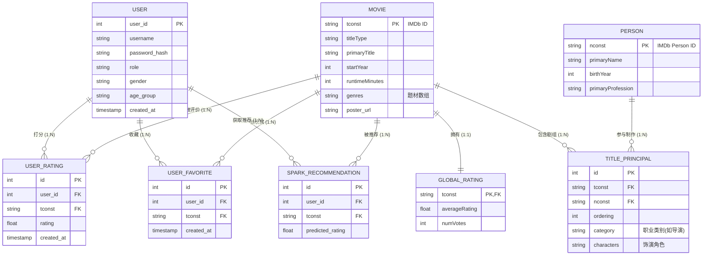

### 第四章 数据库设计

数据库是影视推荐系统的数据底座。面对千万级别的 IMDb 影视源数据、高频的用户交互以及复杂的混合推荐模型，合理的数据库设计不仅关乎系统的数据完整性，更是决定系统高并发吞吐量与查询性能的关键。本章将详细阐述系统的概念结构设计与逻辑表结构设计。

#### 4.1 概念结构设计

概念结构设计（Conceptual Structure Design）旨在将需求分析阶段提炼出的业务实体及其逻辑联系，抽象为独立于具体数据库管理系统（DBMS）的信息模型。本系统采用实体-联系模型（Entity-Relationship Model，简称 E-R 模型）来进行概念建模。

**1. 核心实体定义**

经过对系统业务逻辑的拆解，提炼出以下三个核心基础实体：

* **用户（User）**：系统的服务对象与行为主体。包含属性：用户 ID（主键）、用户名、加密密码、角色权限（普通用户/管理员）、性别、年龄段、注册时间等。
* **影视作品（Movie/TitleBasics）**：系统的核心资源实体。由于接入了 IMDb 数据集，涵盖电影、剧集、短片等多种类型。包含属性：影视编号（tconst，主键）、类型（titleType）、主标题、原名、上映年份、时长、题材分类（genres）、海报链接等。
* **演职人员（Person/NameBasics）**：参与影视制作的实体人员。包含属性：人员编号（nconst，主键）、姓名、出生年份、死亡年份、核心职业分类等。

**2. 核心联系（Relationships）定义**

实体之间通过复杂的业务逻辑相互关联，主要包括以下几类联系：

* **用户与影视作品的“交互”联系（多对多 M:N）**：
* **评分（Rating）**：一个用户可以对多部影视打分，一部影视也可以被多个用户打分。该联系生成属性：评分值（1-10分）、打分时间。
* **收藏（Favorite）**：一个用户可以收藏多部影视，一部影视可被多个用户收藏。该联系生成属性：收藏时间。
* **离线推荐（Recommend）**：Spark 计算引擎为每个用户生成对多部未看影视的推荐。该联系生成属性：预测评分得分。

* **演职人员与影视作品的“参演/制作”联系（多对多 M:N）**：
* **剧组关系（Principal）**：一名演职人员可以参与多部影视（如既当导演又当演员），一部影视包含多名演职人员。该联系具有属性：职位分类（category，如 actor, director）、具体职务（job）、饰演角色（characters）、排序权重（ordering）。

* **影视作品与自身的“附属”联系（一对一 / 一对多）**：
* **全局评分（Global Rating）**：每一部影视作品对应唯一的全局客观评分汇总（1:1）。属性包括：全网平均分、总投票数。
* **剧集关系（Episode）**：一部长篇剧集（Series）可以包含多个单集（Episode）（1:N）。属性包括：所属季数（seasonNumber）、所属集数（episodeNumber）。

**3. 全局 E-R 图展示**

为了直观地表达上述实体与实体之间的结构关系，绘制了系统的核心 E-R 图（如下所示，您可以在论文中使用 Visio 或 Draw.io 将此逻辑转化为标准的图形表示，或者直接使用以下 Markdown 支持的 Mermaid 语法渲染）：

**E-R 图解析总结：**
通过上述 E-R 模型可以看出，系统采用高度规范化的设计。`MOVIE` (影视) 和 `USER` (用户) 是整个信息流转的中心枢纽。由于关系型数据库无法直接实现多对多的物理关联，概念模型中的 M:N 联系（如打分、收藏、演职关系）在逻辑上均被拆解为独立的中间关系实体（如 `USER_RATING`, `TITLE_PRINCIPAL`），这为后续的逻辑表结构设计与外键约束奠定了理论基础。